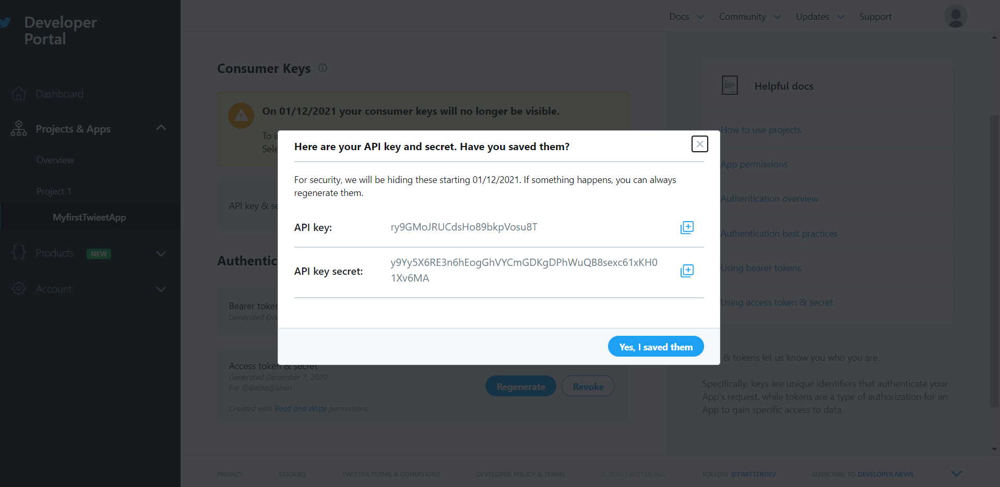
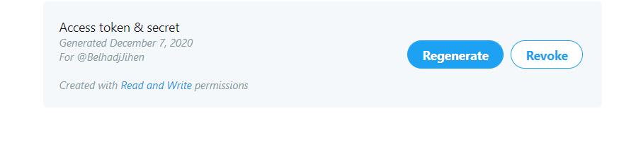

Tweeter_Project

Le but de ce tp est de :
 
•Maitriser l’API de twitter pour l’extraction des tweets
 
• Maitriser la partie NLP (natural language processing) avec NLTK en Python
 
• Appliquer les principes de nettoyage des données
 
• Classer les tweets : regrouper ensemble les tweets qui sont similaires. C’est une étape qui peut
 
 être considérée comme une étape
  
 #Obtention de l'API:
 

  
  

